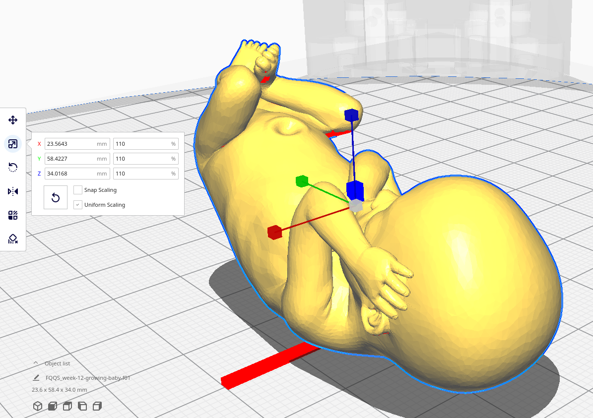

# meshes-factor-f01-proportion-105-with-cura

## Running software CURA v.4.11.0
```
cd $HOME/Downloads
./Ultimaker_Cura-4.11.0.AppImage 
```

## Open stl and scale to 110 to then be exported as ASCII stl files.


