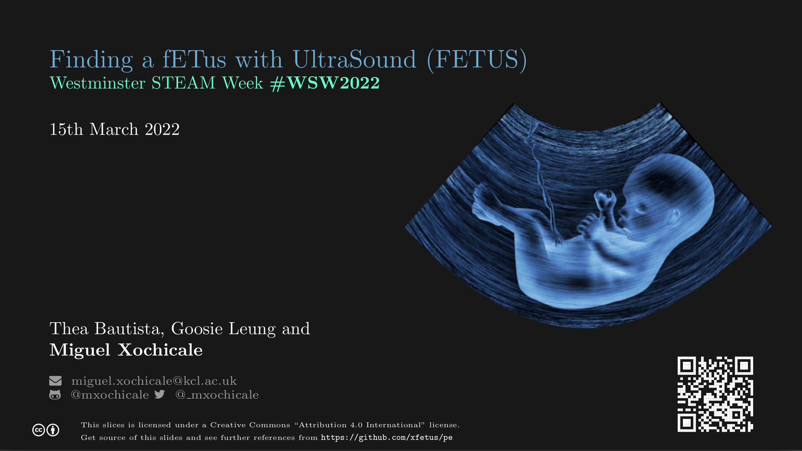
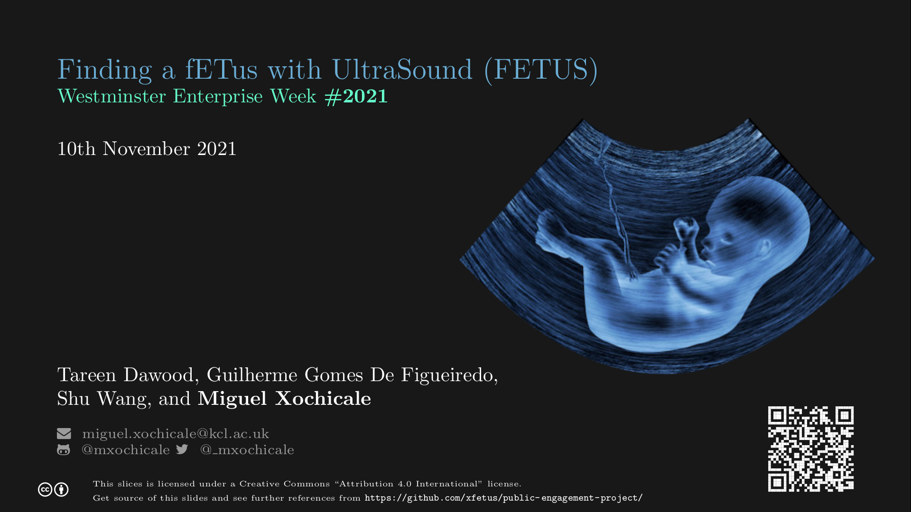

# :microscope: Public Engagement Project: Finding a fETus with UltraSound (FETUS)
The aim of the FETUS project is to increase the awareness of young people, living in Southwark and Lambeth with the involvement of The Young Persons’ Advisory Group (YPAG), on what biomedical engineers do and the impact they make to society.
Similarly, we aim that young audiences get a better understanding of the diversity of jobs in healthcare, as well as develop their interests in STEM areas. 
We will achieve this through creative and interactive public engagement activities that explore our research in the areas of surgery and interventional engineering (e.g., soft materials, mechanics and robotics).

That said, over a one-hour workshop, participants will have first-hand experience through three activities of the current and future challenges of surgical and interventional engineering: a) guess the age of a baby before birth (fetus) (b) play with a placenta phantom and (c) play with a simulator to tracking needles that are used to access the fetus with ultrasound. 
To make a memorable PE experience, participants will then be awarded with souvenirs of 3D printed fetal phantoms or 3D printed key rings.

The anticipated outcomes of the project are the creation of mutual benefit between young audiences and research engineers by (a) encouraging young audience to pursuit a career in STEM and (b) improving communications and project managements skills of research engineers. 
In addition, such activities will help to engage with other researchers and clinicians that might spark collaboration and the potential usage of the current activities in future events targeting other type of audiences.

## Events 

### N03 - Westminster STEAM Week on 15th March 2022
[](https://github.com/xfetus/public-engagement-project/blob/pdfs/slides-WSW2022.pdf) 
[](https://github.com/xfetus/public-engagement-project/actions) 
[](documents/slides/WSW2022) 

<div style="width: 50%; height: 50%">

[ ](https://github.com/xfetus/pe/blob/pdfs/slides-WSW2022.pdf)
</div>

### N02 - Westminster Enterprise Week on 10th November 2021
[](https://github.com/xfetus/public-engagement-project/actions) [](https://github.com/xfetus/public-engagement-project/blob/pdfs/slides-wek2021.pdf) [](documents/slides/WEK2021) [](documents/blogs/22-DEC-2021) 

<div style="width: 60%; height: 60%">

[ ](https://github.com/xfetus/public-engagement-project/blob/pdfs/slides-wek2021.pdf)
</div>

### N01 - King's Health Partners Summer School on 6th July 2021
[](https://github.com/xfetus/public-engagement-project/actions) [](https://github.com/ofetus/us-simulator/blob/pdfs/slides.pdf) [](documents/slides/KHPSS2021) 

<div style="width: 60%; height: 60%">

[ ](https://github.com/xfetus/public-engagement-project/blob/pdfs/slides.pdf)
</div>

## Clone repo
After generating your SSH keys as suggested [here](https://github.com/mxochicale/tools/blob/main/github/SSH.md), you can then clone the repository by typing (or copying) the following line in a terminal at your selected path in your machine:
```
git clone git@github.com:xfetus/pe.git
```

## Contributors
Thanks goes to all these people ([emoji key](https://allcontributors.org/docs/en/emoji-key)):  
<!-- ALL-CONTRIBUTORS-LIST:START - Do not remove or modify this section -->
<!-- prettier-ignore-start -->
<!-- markdownlint-disable -->

<table>
  <tr>
    <td align="center"><a href="https://github.com/mxochicale"><br /><sub><b>Miguel Xochicale</b></sub>           </a><br /><a href="https://github.com/xfetus/public-engagement-project/commits?author=mxochicale" title="Code">💻</a> <a href="https://github.com/fepegar/torchio/commits?author=mxochicale" title="Documentation">📖</a></td>
    <td align="center"><a href="https://github.com/silver2008a2"><br /><sub><b> Shu Wang </b></sub>        </a><br /><a href="https://github.com/xfetus/public-engagement-project/commits?author=" title="Research">  🔬 🤔  </a></td>    
    <td align="center"><a href="https://github.com/hoga85"><br /><sub><b> Fang-Yu Lin  </b></sub>   </a><br /><a href="https://github.com/xfetus/public-engagement-project/commits?author=" title="Code">💻</a> </td>
    <td align="center"><a href="https://github.com/AmalHussein99"><br /><sub><b>Amal Hussein </b></sub>             </a><br /><a href="https://github.com/xfetus/public-engagement-project/commits?author=AmalHussein99" title="Code">💻</a></td>
    <td align="center"><a href="https://github.com/RoyoTLH"><br /><sub><b> Zhanchong Ou </b></sub>        </a><br /><a href="https://github.com/xfetus/public-engagement-project/commits?author=" title="Code">💻</a></td>
    <td align="center"><a href="https://twitter.com/bella9spencer"><br /><sub><b> Bella Spencer </b></sub>        </a><br /><a href="https://github.com/xfetus/public-engagement-project/commits?author=" title="Research">  🔬 🤔  </a></td>
    <td align="center"><a href="https://github.com/tardaw"><br /><sub><b>Dawood Tareen </b></sub>        </a><br /><a href="https://github.com/xfetus/public-engagement-project/commits?author=" title="Research">  🔬 🤔  </a></td>
    <td align="center"><a href="https://github.com/Guilherme-GDF"><br /><sub><b>Guillerme Gomes De Figueiredo </b></sub>        </a><br /><a href="https://github.com/xfetus/public-engagement-project/commits?author=" title="3D-printing">  🔬 🤔  </a></td>
  </tr>
</table>
<!-- markdownlint-restore -->
<!-- prettier-ignore-end -->

<!-- ALL-CONTRIBUTORS-LIST:END -->

This work follows the [all-contributors](https://github.com/all-contributors/all-contributors) specification.  
Contributions of any kind welcome!
