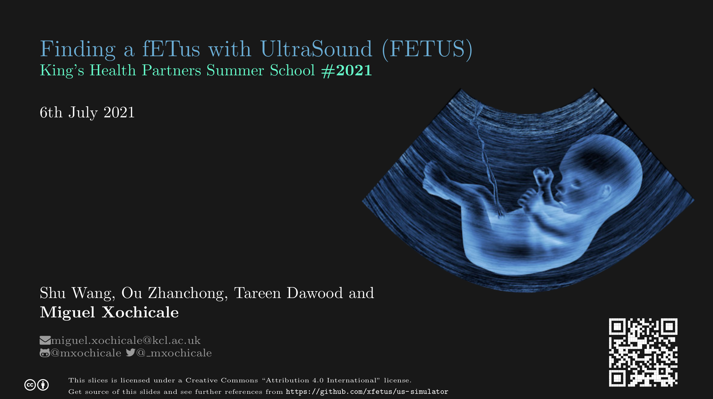

# Finding a fETus with UltraSound (FETUS)
The aim of the project is to increase the awareness of young people, living in Southwark and Lambeth with the involvement of The Young Persons’ Advisory Group (YPAG), on what research engineers do and the impact they make to society. We will achieve this through creative and interactive public engagement activities that explore our research in the areas of surgery and interventional engineering (e.g., soft materials, mechanics and robotics). Similarly, we aim that young audiences get a better understanding of the diversity of jobs in healthcare, as well as develop their interests in STEM areas. 

Our team work with fetal medicine experts to improve the diagnosis and treatment of babies before birth. This is a challenging area because they are small and inaccessible where they develop in the womb. Over a one-hour workshop, participants will have first-hand experience through three activities of the current and future challenges of surgical and interventional engineering: a) guess the age of a baby before birth (fetus) (b) play with a placenta phantom and (c) play with a simulator to tracking needles that are used to access the fetus with ultrasound. To make a memorable PE experience, participants will then be awarded with souvenirs of 3D printed fetal phantoms or 3D printed key rings.

The anticipated outcomes of the project are the creation of mutual benefit between young audiences and research engineers by (a) encouraging young audience to pursuit a career in STEM and (b) improving communications and project managements skills of research engineers. In addition, such activities will help to engage with other researchers and clinicians that might spark collaboration and the potential usage of the current activities in future events targeting other type of audiences.

## Slides
[](https://github.com/ofetus/us-simulator/actions) [](https://github.com/ofetus/us-simulator/blob/pdfs/slides.pdf) [LaTeX-project](documents/slides)    




## Clone repo
After generating your SSH keys as suggested [here](https://docs.github.com/en/github/authenticating-to-github/generating-a-new-ssh-key-and-adding-it-to-the-ssh-agent), you can then clone the repository by typing (or copying) the following line in a terminal at your selected path in your machine:
```
git clone git@github.com:xfetus/us-simulator.git
```

## Contributors   
Dawood, Tareen [@tardaw](https://github.com/tardaw)   
Hussein, Amal [@AmalHussein99](https://github.com/AmalHussein99)    
Lin, Fang-Yu [@hoga85](https://github.com/hoga85)    
Ou, Zhanchong [@RoyoTLH](https://github.com/RoyoTLH)     
Wang, Shu [@silver2008a2](https://github.com/silver2008a2)     
Xochicale, Miguel [@mxochicale](https://github.com/mxochicale)  
