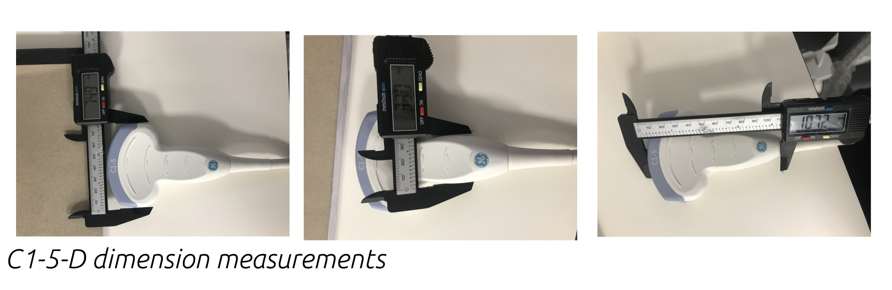

# CAD Design of C1-5-D probe

## Foot print 
The foot print of the C1-5-D probe is 69.3X17.2mm (Voluson E10 Datasheet). However, dimension measurements are shown below

## CHANGELOG
See [CHANGELOG](CHANGELOG.md) to track changes of the CAD files.
