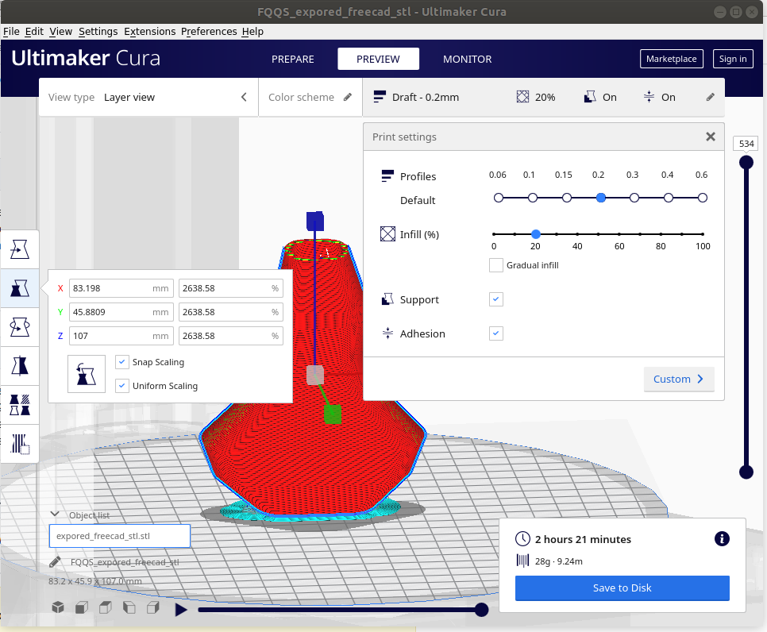

# v01 freecad

## settings of cura project 

## Notes
* with Loft, use rule surface

## References

* Thickness selection Loft vs sweep  
https://www.youtube.com/watch?v=ggJ6tORsAS4  

* FreeCAD Make a Bottle Part Design Curves  
https://www.youtube.com/watch?v=Gmu3y9XtXpU  

