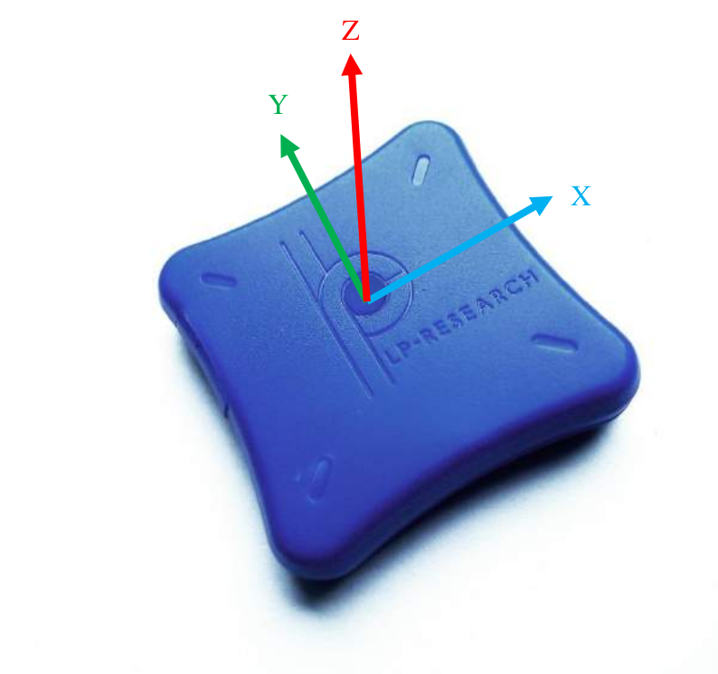

# LPMS-B2 imus

> The LP-RESEARCH Motion Sensor (LPMS) is a miniature, multi-purpose inertial measurement
unit. We designed the unit to be as small as possible so that it can be used in a wide range of
applications, from measuring the human motion to the stabilization of ground vehicles or airplanes.
The unit can measure orientation in 360 degrees about all three global axes. Measurements are taken
digitally and transmitted to a data analysis system in the form of orientation quaternion or Euler
angles. Whereas Euler angles are one way of describing the orientation of an object, a quaternion
allows orientation measurement without encountering the so-called Gimbal’s lock. This is achieved
by using a four-element vector to express orientation around all axes without being limited by
singularities.

## Content 
* [adquistion-software](adquistion-software)
* [cad-models](cad-models)
* [datasheets](datasheets)

## Key features
### Orientations

Figure 3 - Axis orientation of LPMS-B2. The direction of the x, y, z-axis (roll, pitch, yaw) of the sensor is displayed
on its label.

