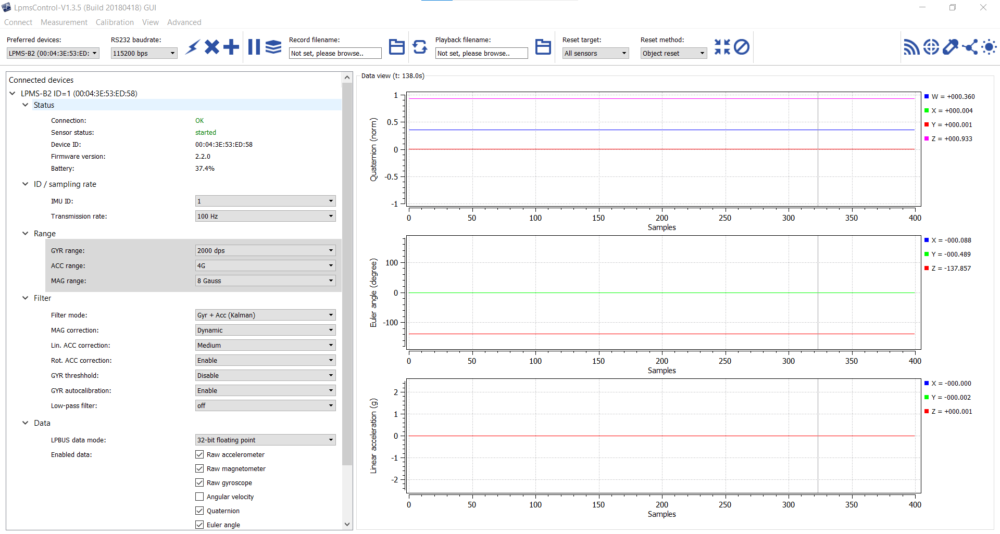

# OpenMAT (LPMS-Control, LpSensor)
The LPMS-Control application allows users to control various aspects of an LPMS device from a PC [ref](https://lp-research.atlassian.net/wiki/spaces/LKB/pages/1100677224/LPMS-Control+Software).

The application has the following core functionality:
* List all LPMS devices connected to the system
* Connect to up to 256 sensors simultaneously
* Adjust all sensor parameters (sensor range etc.).
* Set orientation offsets
* Initiate accelerometer, gyroscope and magnetometer calibration.
* Display the acquired data in real-time either as line graphs or a 3D image
* Record data from the sensors to a CSV data file
* Play back data from a previously recorded CSV file
* Upload new firmware and in-application-programming software to the sensor

LPMS-Control can be downloaded directly from the LP-Research website support page.

## Downloads
* https://bitbucket.org/lpresearch/openmat/downloads/
* https://bitbucket.org/lpresearch/openmat/downloads/OpenMAT-1.3.5-Setup-Build20180418.exe

## Installation
Download `OpenMAT-1.3.5-Setup-Build20180418.exe` and installing at `C:\OpenMAT\OpenMAT-1.3.5`  

## Usage 
1. Connect bluetooth dongle
2. Switch on LPMS-B2   
2. Open LPMS-Control going to OpenMAT>LpmsControl-V1.3.5
3. Click connect in the APP    

   
To disconnect
1. Disconnect sensor from the app
2. switch off LPMS-B2 and disconnect bluetooh dongle

NOTE. Filter mode might impact the measurements, so it is suggested to look closer to the manual and do further investigation to be sure the values have little drift.

## Documentation
https://lp-research.atlassian.net/wiki/spaces/LKB/pages/1100677224/LPMS-Control+Software 
