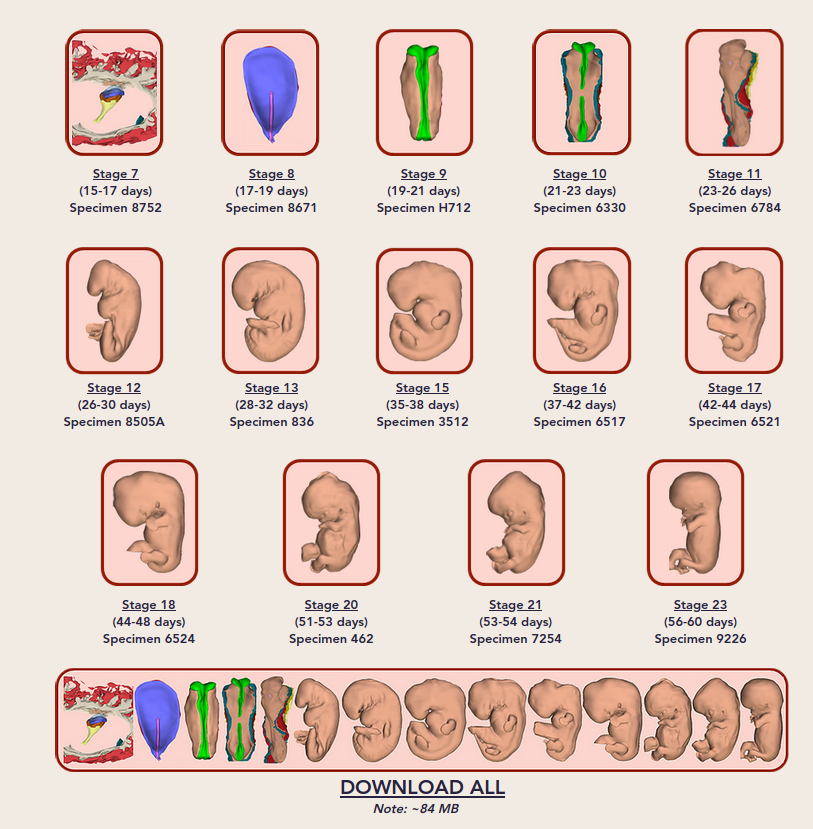

## Citations
103

https://scholar.google.com/scholar?cites=17275330312416840240&as_sdt=2005&sciodt=0,5&hl=en

Retrived Fri  9 Apr 00:28:52 BST 2021

## Authors 

## Links 
https://twitter.com/Harsha_Shah86
https://www.youtube.com/watch?v=S4hF2Lkgm5g&t=272s
https://twitter.com/christoph_lees

https://www.linkedin.com/company/aiumultrasound/
https://www.3dembryoatlas.com/publications
https://science.sciencemag.org/content/354/6315/aag0053/tab-article-info

# 3D Embryo Atlas
* https://www.3dembryoatlas.com/

