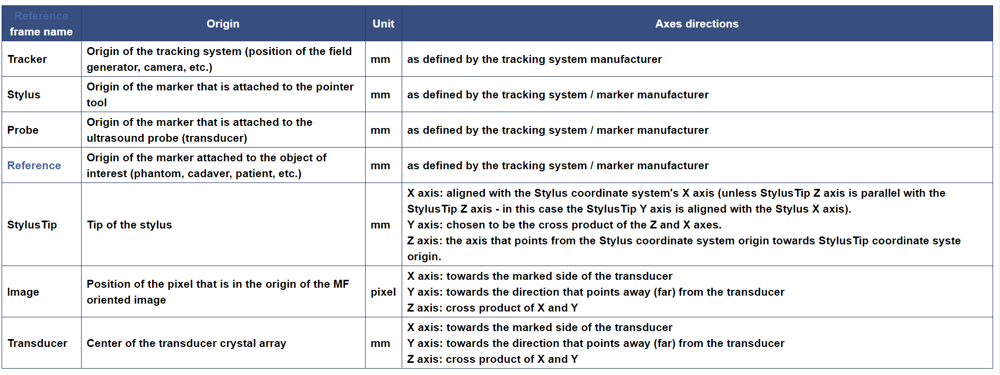

# commonly used coordinate systems
The following coordinate systems are used commonly:

## Example CoordinateSystems.mrb
1. Open 3d slicer and choose file add `CoordinateSystems.mrb`
2. Chose All Menu to Transforms 

## References
* http://perk-software.cs.queensu.ca/plus/doc/nightly/dev/CommonCoordinateSystems.html
