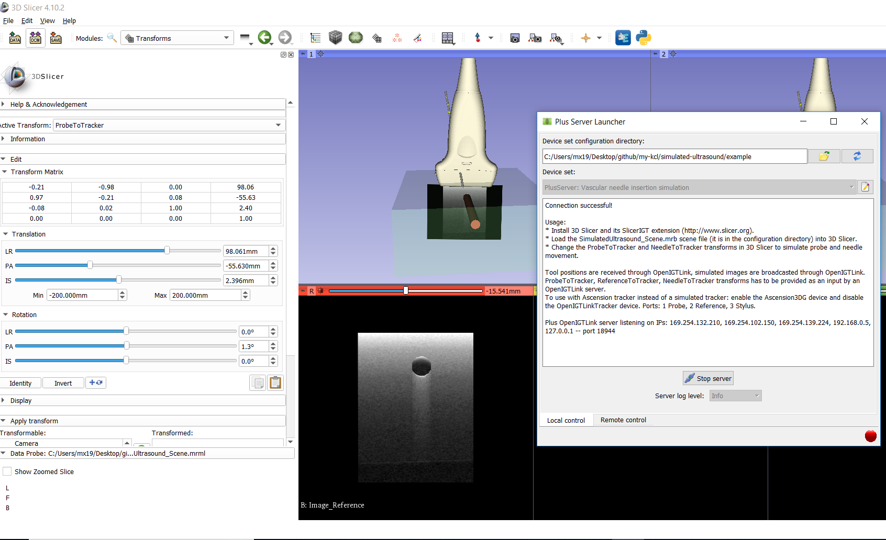

# Simulated ultrasound
This application uses SlicerIGT (www.slicerigt.org) and PLUS (www.plustoolkit.org). 
The objects that appear on the ultrasound are defined by surface meshes and material 
properties. Objects pose can be static or provided by a tracking device. 
Arbitrary number of objects and any transducer geometry can be simulated. 
In this demo both the tool tracking device and the ultrasound imaging device is simulated. 
The same software can be connected to a real tracking and/or imaging device, 
only a configuration file has to be modified. See [tutorial](http://perk-software.cs.queensu.ca/plus/doc/nightly/user/ProcedureUltrasoundSimulation.html)   
and [video](https://www.youtube.com/watch?v=2Oc_tCu_uzs) for more detailed information.

## Example
* Download the following ConfigFiles from [the repository](https://github.com/PlusToolkit/PlusLibData/tree/master/ConfigFiles/)
    * PlusDeviceSet_Server_SimulatedUltrasound_3DSlicer.xml
    * SimulatedUltrasound_GelBlockModel_Reference.stl
    * SimulatedUltrasound_NeedleModel_NeedleTip.stl
    * SimulatedUltrasound_Scene.mrb
    * SimulatedUltrasound_VesselModel_Reference.stl    
* Download and install the latest nightly build of 3D Slicer and the SlicerIGT extension
* Load the Test_PlusConfiguration_SimulatedUS.mrb file into 3D Slicer
* Select `OpenIGTLinkIF` and check the status of Active and Persistent 
* Open application `Plus command prompt` and run
```
cd ..\example\ 
PlusServer.exe -–config-file=PlusDeviceSet_Server_SimulatedUltrasound_3DSlicer.xml
```
 or you can also use Plus Server Launcher as shown below. 
* In Slicer go to the Transforms module and modify the ProbeToTracker and NeedleToTracker transforms


## References 
* https://plustoolkit.github.io/download.html
* http://perk-software.cs.queensu.ca/plus/doc/nightly/user/ProcedureUltrasoundSimulation.html
* http://perk.cs.queensu.ca/sites/perkd7.cs.queensu.ca/files/Bartha2013b.pdf
* https://www.youtube.com/watch?v=2Oc_tCu_uzs
* Coordinate transformation:
    * https://onedrive.live.com/view.aspx?resid=7230D4DEC6058018!3096&ithint=file%2cpptx&authkey=!ACPMkhirC4PXBpI
    * https://github.com/PlusToolkit/PlusLib/issues/496
    * http://perk-software.cs.queensu.ca/plus/doc/nightly/dev/CoordinateSystemDefinitions.html
* https://github.com/PlusToolkit/PlusDoc    
    
    
## Issues
* https://github.com/PlusToolkit/PlusLib/issues/692

## Convex probe
* model: https://github.com/PlusToolkit/PlusModelCatalog/tree/651be1563b40a3552f18436f580d1c14d1b388f9/Tools


